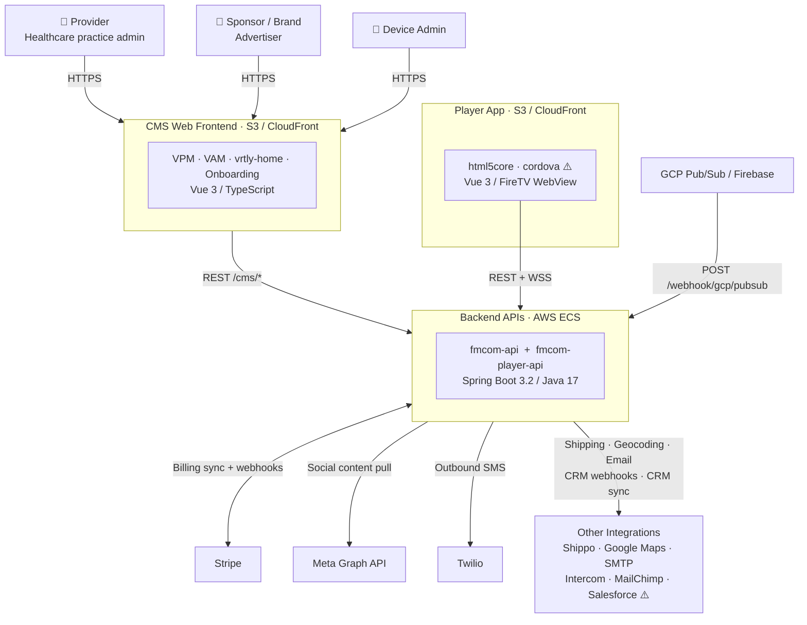
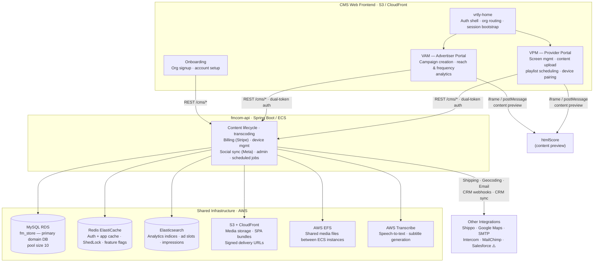
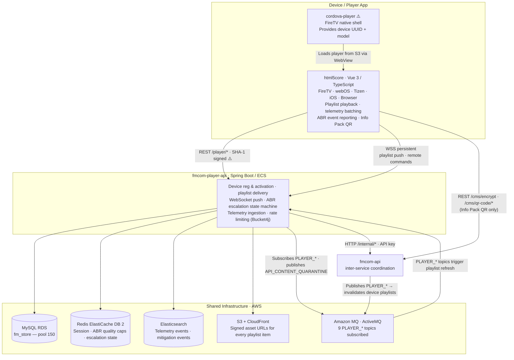
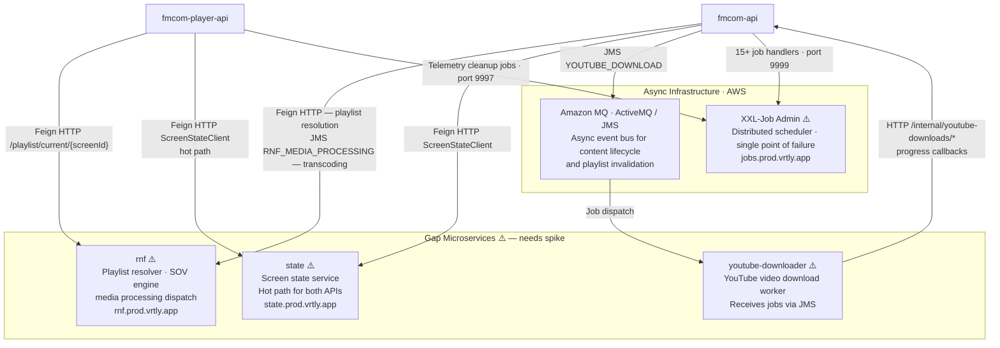

# System Overview Diagram: Vrtly Platform

Four focused views of the platform. Each diagram covers one concern area and stays under 15 nodes. Gap services (not yet spiked) are marked **⚠️**.

---

## View 1 — System Context

Who uses the platform, what the main system areas are, and which external services are integrated. No internal detail.

---

## View 2 — CMS Frontend + fmcom-api

Internal structure of the CMS portals, how they route to the backend, and the infrastructure fmcom-api owns.

---

## View 3 — Player App + fmcom-player-api

Device-side player, the player API, and the infrastructure it owns. Includes the inter-service call back to fmcom-api.

---

## View 4 — Async + Gap Services

Asynchronous event flows, scheduled jobs, and the three gap microservices that need spiking.

---

## Gap Services — Needs Follow-up Spike

| Service | Evidence | Priority |
|---|---|---|
| `rnf` (reach-and-frequency / playlist resolver) | Called by both backend APIs; owns SOV logic and media processing | High — critical path for playlist delivery |
| `state` service | Called in hot paths by both APIs via `fm-common` `ScreenStateClient` | High — screen lookup performance risk |
| `youtube-downloader` | Bidirectional with `fmcom-api` via JMS + internal HTTP | Medium |
| `cordova-player` (FireTV shell) | Wraps `html5core`; provides device identity to player app | Medium |
| Roku player app | Special-cased in `fmcom-player-api` (MAC migration, cert override) | Medium |
| Android TV player app | Implied by device type enum in `fmcom-player-api` | Low |
| `fm-common` JAR (v8.9.0 / v8.8.9) | Defines all JMS destinations, Redis key constants, domain models — shared contract layer | High — version skew between APIs is a deployment risk |
| `@vrtly/component-library` | Consumed by `fmcom-vrtly-fe-monorepo` at `^0.8.20` | Low |
| `my.vrtly.app` (patient info-pack portal) | QR code landing page referenced by `html5core` | Low |
| XXL-Job Admin | Single point of failure for all scheduled tasks across both APIs | Medium |

---

## Notable Architectural Risks (surfaced during discovery)

- **`private_key.pem` committed to source** in `fmcom-player-api` — CloudFront signing key exposed in repo history.
- **Shared MySQL database** between `fmcom-api` and `fmcom-player-api` — each runs Liquibase migrations independently; schema coordination risk.
- **`fm-common` version skew** — `fmcom-api` on 8.9.0, `fmcom-player-api` on 8.8.9; breaking changes require coordinated deployments with no published compatibility matrix.
- **In-memory session store** (`SessionHolder`) in `fmcom-player-api` — not horizontally safe; ECS scale-out requires ALB sticky sessions or silent WebSocket push drops occur.
- **SHA-1 request signing** between `html5core` and `fmcom-player-api` — deprecated for authentication use cases.
- **Unauthenticated HLS streaming endpoint** — `/player/content/stream/...` explicitly excluded from all security interceptors in `fmcom-player-api`.
