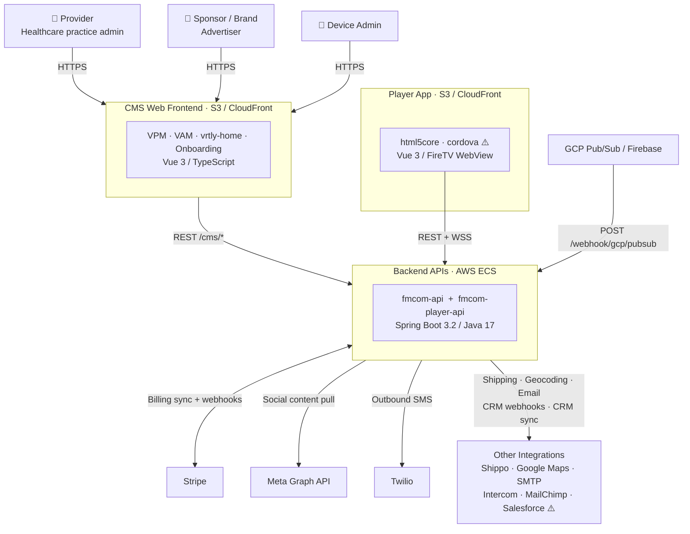
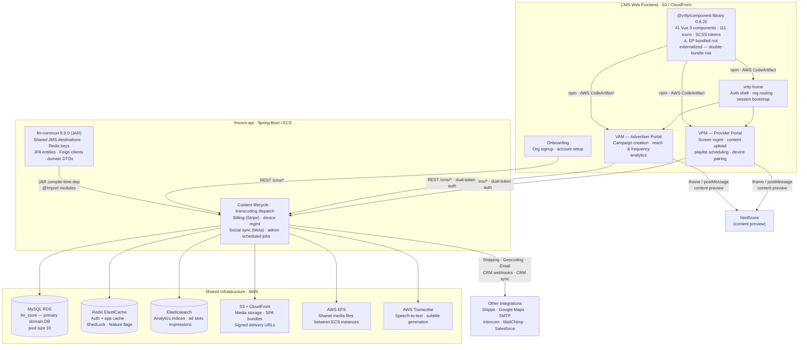
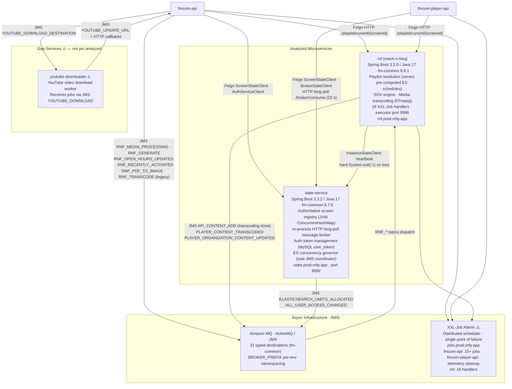
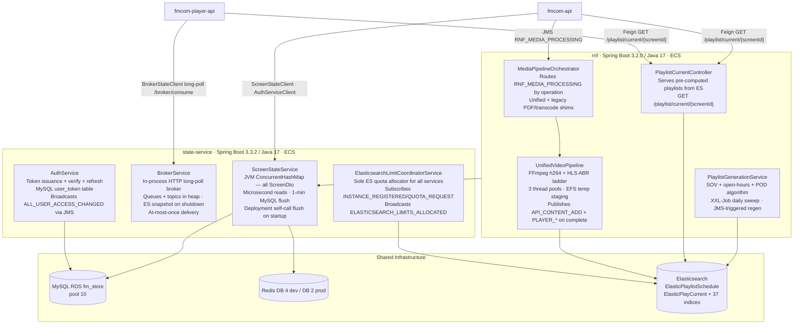

# System Overview Diagram: Vrtly Platform

Five focused views of the platform. Each diagram covers one concern area and stays under 15 nodes. Gap services (not yet spiked) are marked **⚠️**. Services confirmed by spike are shown without warning markers.

---

## View 1 — System Context

Who uses the platform, what the main system areas are, and which external services are integrated. No internal detail.

---

## View 2 — CMS Frontend + fmcom-api

Internal structure of the CMS portals, how they route to the backend, and the infrastructure fmcom-api owns. `fm-common` is shown as a shared library dependency of fmcom-api (not a standalone service). `@vrtly/component-library` is annotated with its double-bundling risk (Element Plus is bundled rather than externalized, producing two EP copies in every SPA).

---

## View 3 — Player App + fmcom-player-api

Device-side player, the player API, and the infrastructure it owns. Includes the inter-service call back to fmcom-api. `fm-common` is shown as a shared library dependency of fmcom-player-api (not a standalone service).

```mermaid
flowchart TD
    subgraph Device["Device / Player App"]
        Cordova["cordova-player ⚠️\nFireTV native shell\nProvides device UUID + model"]
        HTML5["html5core · Vue 3 / TypeScript\nFireTV · webOS · Tizen · iOS · Browser\nPlaylist playback · telemetry batching\nABR event reporting · Info Pack QR"]
    end

    subgraph PAPI["fmcom-player-api · Spring Boot / ECS"]
        PACore["Device reg & activation · playlist delivery\nWebSocket push · ABR escalation state machine\nTelemetry ingestion · rate limiting (Bucket4j)"]
        FMCommonP["fm-common 8.8.9 (JAR)\nShared JMS destinations · Redis keys\nJPA entities · Feign clients · domain DTOs\n⚠️ one minor version behind fmcom-api (8.9.0)"]
    end

    subgraph Infra["Shared Infrastructure · AWS"]
        MySQL[("MySQL RDS\nfm_store — pool 150")]
        Redis[("Redis ElastiCache DB 2\nSession · ABR quality caps · escalation state")]
        ES[("Elasticsearch\nTelemetry events · mitigation events")]
        S3CF["S3 + CloudFront\nSigned asset URLs for every playlist item"]
        MQ["Amazon MQ · ActiveMQ\n9 PLAYER_* topics subscribed"]
    end

    FMComAPI["fmcom-api\ninter-service coordination"]

    Cordova -->|"Loads player from S3 via WebView"| HTML5
    HTML5 -->|"REST /player/* · SHA-1 signed ⚠️"| PACore
    HTML5 -->|"WSS persistent\nplaylist push · remote commands"| PACore
    HTML5 -->|"REST /cms/encrypt · /cms/qr-code/*\n(Info Pack QR only)"| FMComAPI

    FMCommonP -->|"JAR compile-time dep\n@Import modules"| PACore
    PACore --> MySQL
    PACore --> Redis
    PACore --> ES
    PACore --> S3CF
    PACore -->|"Subscribes PLAYER_* · publishes API_CONTENT_QUARANTINE"| MQ
    PACore -->|"HTTP /internal/* · API key"| FMComAPI
    FMComAPI -->|"Publishes PLAYER_* → invalidates device playlists"| MQ
    MQ -->|"PLAYER_* topics trigger playlist refresh"| PACore
```

---

## View 4 — Async + Gap Services

Asynchronous event flows, scheduled jobs, confirmed microservices (rnf, state), and remaining gap services. rnf and state-service are now analyzed; youtube-downloader and xxl-job-admin remain unanalyzed (⚠️). State-service owns the ES concurrency budget; rnf is the sole transcoder and publishes `API_CONTENT_ADD` after every successful transcode.

---

## View 5 — Internal Microservices

Internal structure of the two newly analyzed backend services — rnf and state-service — and their relationships to the calling APIs and shared infrastructure. rnf is split into four functional subsystems; state-service into four owned capabilities. Both services share the same MySQL (`fm_store`) and Elasticsearch cluster as fmcom-api and fmcom-player-api.

---

## Gap Services — Status

### Resolved (spiked)

| Service | Spike Date | Key Findings |
|---|---|---|
| `rnf` (reach-n-freq) | 2026-06-12 | Spring Boot 3.2.0 / Java 17 / `fm-common` 8.9.1. Playlist resolver (serves pre-computed ES schedules), SOV engine, FFmpeg transcoder, 18 XXL-Job handlers (port 9996). JMS: subscribes to 6 RNF_* queues; publishes `API_CONTENT_ADD` (sole transcoding publisher), `PLAYER_CONTENT_TRANSCODED`, `PLAYER_CONTENTS_TRANSCODED_BATCH`, `PLAYER_ORGANIZATION_CONTENT_UPDATED`, `PLAYER_SCREEN_CONTENT_UPDATED`. Hard `System.exit(-1)` on state-service heartbeat loss. |
| `state-service` | 2026-06-12 | Spring Boot 3.3.2 / Java 17 / `fm-common` 8.7.8 (oldest version in fleet). Authoritative screen registry (JVM `ConcurrentHashMap`), in-process HTTP long-poll broker, auth token management (`user_token` MySQL table), sole ES concurrency budget coordinator. No `SecurityFilterChain` — all endpoints open within VPC. Port 9092. |
| `fm-common` JAR | 2026-06-12 | Current source at 8.9.1. Four production versions: fmcom-api 8.9.0, fmcom-player-api 8.8.9, rnf 8.9.1, state 8.7.8. 31 typed JMS destinations, 80+ MySQL JPA modules, 37 Elasticsearch modules, all Feign clients for state-service. No CHANGELOG; no auto-configuration. |
| `@vrtly/component-library` | 2026-06-12 | Version 0.8.20. 41 Vue 3 components, 111 icons, SCSS token system. Element Plus bundled (not externalized) — double-bundle risk in all four SPAs. ESM-only with broken `require` field. No CHANGELOG; no integration test against monorepo. |

### Outstanding (not yet analyzed)

| Service | Evidence | Priority |
|---|---|---|
| `youtube-downloader` | Bidirectional with `fmcom-api` via JMS (`YOUTUBE_DOWNLOAD_DESTINATION`, `YOUTUBE_UPDATE_URL_DESTINATION`) + internal HTTP; `rnf` has a `YoutubeContentDownloadReenqueueJob` whose relationship to fmcom-api's `YoutubeDownloadRescueService` is unclear | Medium |
| `cordova-player` (FireTV shell) | Wraps `html5core`; provides device UUID, model, and version via `window._cordovaNative` | Medium |
| Roku player app | Special-cased in `fmcom-player-api` (`RokuMacMigrationService`, `RokuCertOverrideService`) | Medium |
| Android TV player app | Implied by device type enum in `fmcom-player-api` | Low |
| `my.vrtly.app` (patient info-pack portal) | QR code landing page referenced by `html5core` as `VITE_INFOPACK_URL`; URLs encrypted server-side before embedding | Low |
| XXL-Job Admin | Single point of failure for all scheduled tasks across three services (fmcom-api: 15+ jobs; fmcom-player-api: telemetry cleanup; rnf: 18 handlers). `state-service` `doc/scheduler-design.md` proposes retiring XXL-Job in favor of state-service as distributed cron coordinator. | Medium |

---

## Notable Architectural Risks (surfaced during discovery)

- **`private_key.pem` committed to source** in `fmcom-player-api` — CloudFront signing key exposed in repo history.
- **Shared MySQL database** between `fmcom-api` and `fmcom-player-api` — each runs Liquibase migrations independently; schema coordination risk.
- **`fm-common` version skew** — `fmcom-api` on 8.9.0, `fmcom-player-api` on 8.8.9; breaking changes require coordinated deployments with no published compatibility matrix.
- **In-memory session store** (`SessionHolder`) in `fmcom-player-api` — not horizontally safe; ECS scale-out requires ALB sticky sessions or silent WebSocket push drops occur.
- **SHA-1 request signing** between `html5core` and `fmcom-player-api` — deprecated for authentication use cases.
- **Unauthenticated HLS streaming endpoint** — `/player/content/stream/...` explicitly excluded from all security interceptors in `fmcom-player-api`.
